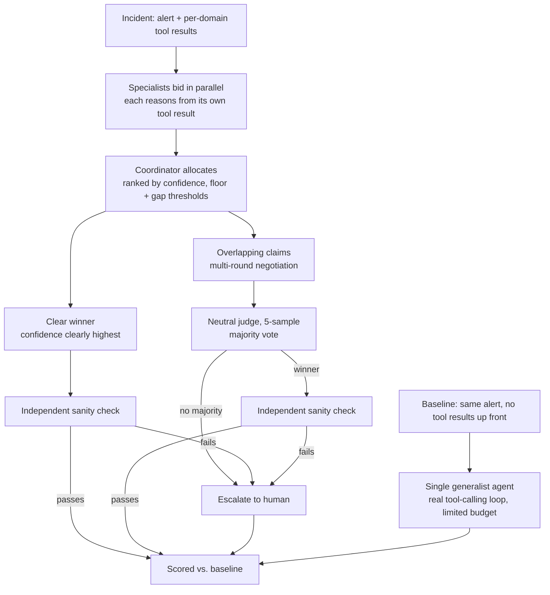

# Incident War Room

**Multi-agent incident triage vs. a single-agent baseline, under a genuinely fair test.**

Built for the **Qwen Cloud Global AI Hackathon — Track 3: Agent Society**.

Five specialist agents (Security, Performance, Database, Networking, Frontend) **bid** for
ownership of an incident based on confidence and estimated investigation cost. When specialists
have competing theories, they run a structured **negotiation** — claim, rebuttal, then a neutral
judge decides by majority vote — to reach consensus, or **escalate to a human** if even the judge
finds the evidence genuinely unclear. Every run is scored against a single generalist baseline
agent on the same incident, under conditions designed so any advantage the multi-agent system
shows is real, not an artifact of the comparison being unfair.

## The asymmetry the comparison depends on

An earlier version of this system had five "specialists" that were really one model wearing
different persona labels, all reading the same shared incident text — there was no structural
reason for coordination to ever beat one well-prompted call, and testing against real Qwen Cloud
confirmed exactly that (tied at best, at 10-18x the token cost). The fix wasn't a better prompt;
it was giving the two systems a genuinely different amount of information to work with, the way
a real incident actually plays out:

- **Multi-agent**: each specialist has its own domain's monitoring tool result available
  immediately and for free — a real security engineer already has SIEM access, they don't
  "spend time" checking it. All five check in parallel.
- **Baseline**: one generalist, working alone, with a real tool-calling loop and a **limited
  investigation budget** (`BASELINE_TOOL_BUDGET`, default 2 of however many tools the incident
  has). It must choose which dashboards to check before it has to commit — mirroring a real
  on-call engineer who can't check everything during a live incident.

This is the actual reason division of labor can help here: parallel, full-domain coverage against
a real per-agent budget constraint, not a cosmetic difference in job titles.

## Why this fits Track 3 (Agent Society)

- **Task division & role assignment**: an auction, not a hardcoded manager→worker hierarchy —
  specialists state their own confidence (and a cost estimate, tracked for efficiency reporting)
  and the coordinator allocates to whoever is most confident.
- **Disagreement resolution**: a structured, multi-round negotiation protocol with an explicit
  escalation path when agents can't converge. A neutral judge (not a self-refereed vote among the
  debating specialists) decides by **self-consistency majority vote** across several independent
  samples — a single low-temperature judge call was measured to flip-flop on genuinely close
  cases in real testing. Both the uncontested clear-winner path *and* a negotiated consensus get
  one independent sanity check before becoming final — a confident diagnosis is still checked
  against the evidence, whether or not anyone challenged it.
- **Measurable efficiency gain**: every incident runs through both systems and is scored on
  root-cause accuracy, a stricter **mechanism accuracy** (does the explanation match the actual
  cause, not just name the right domain?), remediation quality (LLM-judge rubric), tokens,
  latency, and cost.

## Architecture



```
┌─────────────┐   ┌───────────────────┐   ┌────────────────────┐
│  Dashboard   │◄──┤  FastAPI backend  │◄──┤   Qwen Cloud API    │
│ (HTML/JS,    │ WS│  (coordinator,    │   │ (DashScope-compat,  │
│  live view)  │──►│  negotiation,     │──►│  Alibaba Cloud)      │
└─────────────┘   │  evaluator)        │   └────────────────────┘
                   └───────────────────┘
                     runs on Alibaba Cloud ECS (see deploy/alibaba_ecs.md)
```

Backend: Python 3.11 + FastAPI. Frontend: vanilla HTML/CSS/JS (no build step), served as static
files by the same process and driven live over a WebSocket. See `backend/app/`:

| File | Responsibility |
|---|---|
| `qwen_client.py` | Qwen Cloud (DashScope, OpenAI-compatible) client: single-shot JSON calls and a real multi-turn tool-calling loop. Falls back to a deterministic mock generator when `QWEN_API_KEY` is unset, and again mid-run if a real API call fails, so a transient quota/network error degrades gracefully instead of crashing the run. |
| `specialists.py` | The 5 specialist personas: bidding (from their own tool result, if any), claims, rebuttals, diagnosis. |
| `coordinator.py` | Ranks bids by confidence (not confidence/cost), picks a winner, detects genuine overlapping claims (gap threshold *and* an absolute confidence floor, so two low-confidence bids landing close together isn't treated as a real dispute). Runs an independent sanity check on both uncontested winners and negotiated consensus outcomes. |
| `negotiation.py` | The claim → rebuttal → neutral-judge-verdict protocol. The judge takes several independent samples and majority-votes, rather than trusting one sample. |
| `baseline.py` | The single generalist agent: a real tool-calling loop under an explicit investigation budget. |
| `orchestrator.py` | Wires bidding → allocation → negotiation/baseline into full runs, streaming events, applying the sanity-check safety net on both resolution paths. |
| `evaluator.py` | Root-cause accuracy, mechanism accuracy, LLM-judge remediation scoring, token/latency/cost aggregation, selective-prediction metrics. |
| `incidents.py` | 8 labeled synthetic incidents, each an `alert` plus a per-specialist-domain `tools` dict (a domain with no tool listed has no monitoring channel relevant to that incident at all). |
| `main.py` | FastAPI app: REST + WebSocket, serves the dashboard. |

## Mock mode (no credentials required)

`qwen_client.py` checks for `QWEN_API_KEY`. If it's unset, every specialist/negotiation/baseline
call is routed to a deterministic mock generator instead of the network — the entire bidding,
negotiation, and evaluation pipeline runs and is fully demoable with **zero credentials**. Once
you have Qwen Cloud credits, set `QWEN_API_KEY` and `QWEN_BASE_URL` in `.env` and every call
switches to real Qwen models — no code changes required.

Model tiering: a fast/cheap model for bidding (`QWEN_MODEL_BID`, default `qwen3.6-flash`), a
mid-tier model for negotiation and the baseline's tool-calling loop (`QWEN_MODEL_NEGOTIATE` /
`QWEN_MODEL_BASELINE`, default `qwen3.7-plus`), and a stronger model for the judge
(`QWEN_MODEL_JUDGE`, default `qwen3.7-max`) — a deliberate cost/performance tradeoff, not uniform
model use everywhere.

## Setup

```bash
cd backend
python -m venv .venv
source .venv/bin/activate        # Windows: .venv\Scripts\activate
pip install -r requirements.txt

cp ../.env.example ../.env       # leave QWEN_API_KEY blank to stay in mock mode
uvicorn app.main:app --reload --port 8000
```

Open `http://localhost:8000`. Pick an incident, click **Run incident**, and watch bids
(each tagged with the tool it checked) → allocation → negotiation (if contested) → resolution →
baseline comparison (with its own budget-limited tools-checked list) stream in live. The
**Evaluation** tab runs all 8 labeled incidents through both systems and shows the aggregate
comparison, including mechanism accuracy.

Run the unit tests (pure logic, no network, run in mock mode):

```bash
cd backend
pytest
```

## How this is scored

The Evaluation tab does not report plain accuracy alone. Escalating to a human and being
confidently wrong are very different outcomes -- one costs a human's time, the other can send
someone down the wrong path in a live incident -- so treating them as equally "not correct"
would hide the actual risk profile of each system. This follows the standard framework for
systems that can abstain instead of answering ("selective prediction" / reject-option
classification):

- **Coverage** -- fraction of incidents the system committed to an answer on. The baseline has
  no abstain option, so its coverage is always 100%.
- **Precision** -- of the incidents it committed to, how many were actually correct.
- **Confidently wrong rate** -- committed to an answer AND got it wrong. This is the outcome
  that carries real risk.
- **Utility score** -- mean of +1 (correct) / 0 (escalated) / -1 (confidently wrong) per
  incident, symmetric by design so the metric isn't tuned to favor either system.
- **Mechanism accuracy** -- the strictest metric: does the produced explanation match the actual
  underlying cause, not just name the right domain? A system can say "networking" and still be
  wrong about *why* (e.g. inventing a load-balancer story instead of the real stale-DNS-TTL
  cause) -- naive domain-label accuracy can't see that gap; mechanism accuracy can.
- **Naive accuracy** is still reported for continuity, but shouldn't be read alone.

## Real results (Qwen Cloud, current architecture)

Three independent full 8-incident batch runs against real Qwen Cloud, after the tool-budget
rebuild:

| Run | Multi-agent accuracy / mechanism accuracy | Baseline accuracy / mechanism accuracy | Token premium | Cost premium |
|---|---|---|---|---|
| 1 | 100% / 100% | 87.5% / 75% | 3.8x | 4.6x |
| 2 | 100% / 100% | 87.5% / 75% | 4.1x | 5.6x |
| 3 | 87.5% / 87.5% | 87.5% / 75% | 4.1x | 6.1x |

Across all three runs, multi-agent's mechanism accuracy was **always at or above** the baseline's
rock-steady 75%, at roughly a 4-6x token/cost premium -- not the 10-18x the earlier, unfair-comparison
architecture cost for no reliable accuracy gain at all. Every multi-agent failure observed traced
to the negotiation step specifically (the clear-winner path was correct in every run), which is
what motivated the confidence-floor and judge-majority-vote fixes already reflected in
`coordinator.py` and `negotiation.py`.
