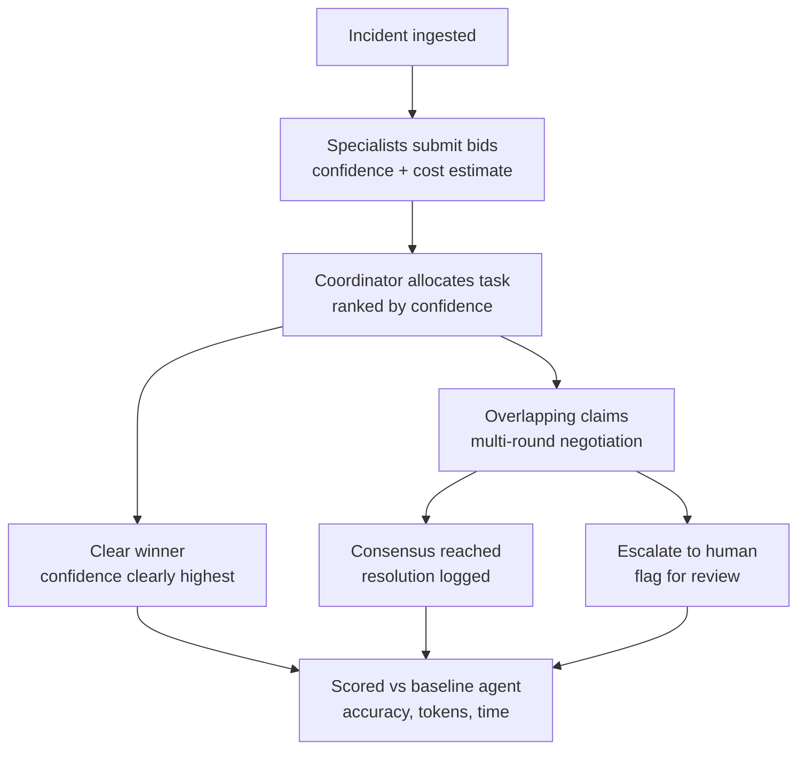

# Incident War Room

**Auction + consensus multi-agent incident triage, benchmarked against a single-agent baseline.**

Built for the **Qwen Cloud Global AI Hackathon — Track 3: Agent Society**.

Production incidents rarely announce which team owns them. Instead of a single generalist
agent guessing at root cause, five specialist agents (Security, Performance, Database,
Networking, Frontend) **bid** for ownership of an incident based on confidence and estimated
investigation cost. When an incident is cross-cutting and specialists have competing theories,
they run a structured **negotiation** — claim, rebuttal, then a neutral judge decides — to reach
consensus, or **escalate to a human** if even the judge finds the evidence genuinely unclear.
Every run is scored against a single generalist
agent on the same incident so the coordination pattern's actual value is measurable, not just
demoable.

## Why this fits Track 3 (Agent Society)

- **Task division & role assignment**: an auction, not a hardcoded manager→worker hierarchy —
  specialists state their own confidence (and a cost estimate, tracked for efficiency
  reporting) and the coordinator allocates to whoever is most confident.
- **Disagreement resolution**: a structured, multi-round negotiation protocol with an explicit
  escalation path when agents can't converge. Even an *uncontested* clear winner gets one
  independent sanity check before its diagnosis becomes final -- a confident lone specialist
  with nobody to challenge it is still checked against the incident's evidence, not trusted
  unreviewed.
- **Measurable efficiency gain**: every incident is run through both the multi-agent system and
  a single generalist baseline, scored on root-cause accuracy, remediation quality (LLM-judge
  rubric), tokens, latency, and cost.

## Architecture



```
┌─────────────┐   ┌───────────────────┐   ┌────────────────────┐
│  Dashboard   │◄──┤  FastAPI backend  │◄──┤   Qwen Cloud API    │
│ (HTML/JS,    │ WS│  (coordinator,    │   │ (DashScope-compat,  │
│  live view)  │──►│  negotiation,     │──►│  Alibaba Cloud)      │
└─────────────┘   │  evaluator)        │   └────────────────────┘
                   └───────────────────┘
                     runs on Alibaba Cloud ECS (see deploy/alibaba_ecs.md)
```

Backend: Python 3.11 + FastAPI. Frontend: vanilla HTML/CSS/JS (no build step), served as static
files by the same process and driven live over a WebSocket. See `backend/app/`:

| File | Responsibility |
|---|---|
| `qwen_client.py` | Qwen Cloud (DashScope, OpenAI-compatible) client. Falls back to a deterministic mock generator when `QWEN_API_KEY` is unset. |
| `specialists.py` | The 5 specialist personas: bidding, claims, rebuttals, diagnosis. |
| `coordinator.py` | Ranks bids by confidence, picks a winner, detects overlapping claims. Cost is tracked but doesn't override confidence. Also runs an independent sanity check on uncontested winners. |
| `negotiation.py` | The claim → rebuttal → neutral-judge-verdict protocol, consensus/escalation logic. |
| `baseline.py` | The single generalist agent used as the comparison point. |
| `orchestrator.py` | Wires bidding → allocation → negotiation/baseline into full runs, streaming events. |
| `evaluator.py` | Root-cause accuracy, LLM-judge remediation scoring, token/latency/cost aggregation. |
| `incidents.py` | 12 labeled synthetic incidents (7 single-domain, 5 deliberately cross-cutting). |
| `main.py` | FastAPI app: REST + WebSocket, serves the dashboard. |

## Mock mode (no credentials required)

`qwen_client.py` checks for `QWEN_API_KEY`. If it's unset, every specialist/negotiation/baseline
call is routed to a deterministic mock generator instead of the network — the entire bidding,
negotiation, and evaluation pipeline runs and is fully demoable with **zero credentials**. Once
you have Qwen Cloud hackathon credits, set `QWEN_API_KEY` and `QWEN_BASE_URL` in `.env` and every
call switches to real Qwen models — no code changes required.

Model tiering (used once real credentials are set): a fast/cheap model for bidding
(`QWEN_MODEL_BID`, default `qwen3.6-flash`) and a stronger model for negotiation and LLM-judge
scoring (`QWEN_MODEL_NEGOTIATE` / `QWEN_MODEL_JUDGE`, default `qwen3.7-plus` / `qwen3.7-max`) — a
deliberate cost/performance tradeoff, not uniform model use everywhere.

## Setup

```bash
cd backend
python -m venv .venv
source .venv/bin/activate        # Windows: .venv\Scripts\activate
pip install -r requirements.txt

cp ../.env.example ../.env       # leave QWEN_API_KEY blank to stay in mock mode
uvicorn app.main:app --reload --port 8000
```

Open `http://localhost:8000`. Pick an incident (incidents marked "cross-cutting" are the ones
likely to trigger negotiation), click **Run incident**, and watch bids → allocation →
negotiation (if contested) → resolution → baseline comparison stream in live. The **Evaluation**
tab runs all 12 labeled incidents through both systems and shows the aggregate comparison.

Run the unit tests (pure logic, no network, run in mock mode):

```bash
cd backend
pytest
```

## How this is scored

The Evaluation tab does not report plain accuracy alone. Escalating to a human and being
confidently wrong are very different outcomes -- one costs a human's time, the other can send
someone down the wrong path in a live incident -- so treating them as equally "not correct"
would hide the actual risk profile of each system. This follows the standard framework for
systems that can abstain instead of answering ("selective prediction" / reject-option
classification):

- **Coverage** -- fraction of incidents the system committed to an answer on. The baseline has
  no abstain option, so its coverage is always 100%.
- **Precision** -- of the incidents it committed to, how many were actually correct (quality
  *conditional on being confident*, separate from how often it's confident).
- **Confidently wrong rate** -- committed to an answer AND got it wrong. This is the outcome
  that carries real risk.
- **Utility score** -- mean of +1 (correct) / 0 (escalated) / -1 (confidently wrong) per
  incident, symmetric by design so the metric isn't tuned to favor either system.
- **Naive accuracy** is still reported for continuity, but shouldn't be read alone -- it scores
  escalation and confidently-wrong identically.

Both `inc-03` (Database vs. Performance, real deadlock incident) and `inc-06` (Security vs.
Performance, real credential-stuffing incident) were confirmed against live Qwen Cloud to
correctly converge on the ground-truth specialist after the allocation and negotiation fixes.
A full 12-incident batch run against real Qwen Cloud, post-fix, showed multi-agent matching
baseline on accuracy (100% vs. 100%) at roughly 11x the token cost and 8x the latency -- see
the per-incident table in the Evaluation tab for the full labeled set and current numbers.
